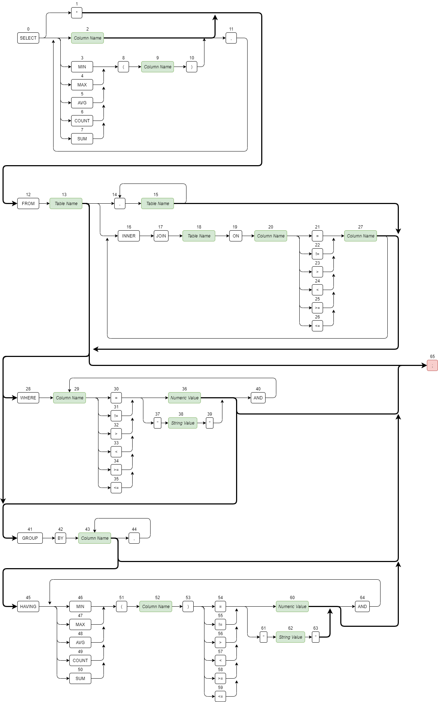
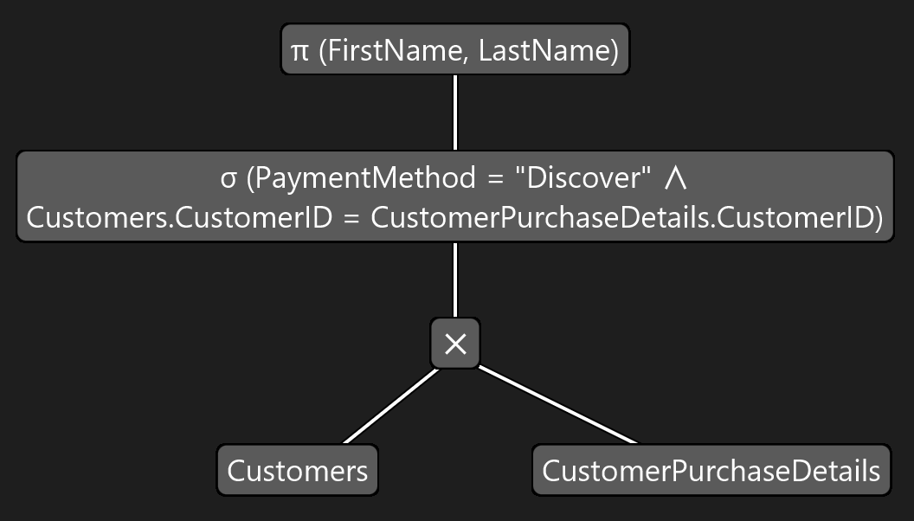
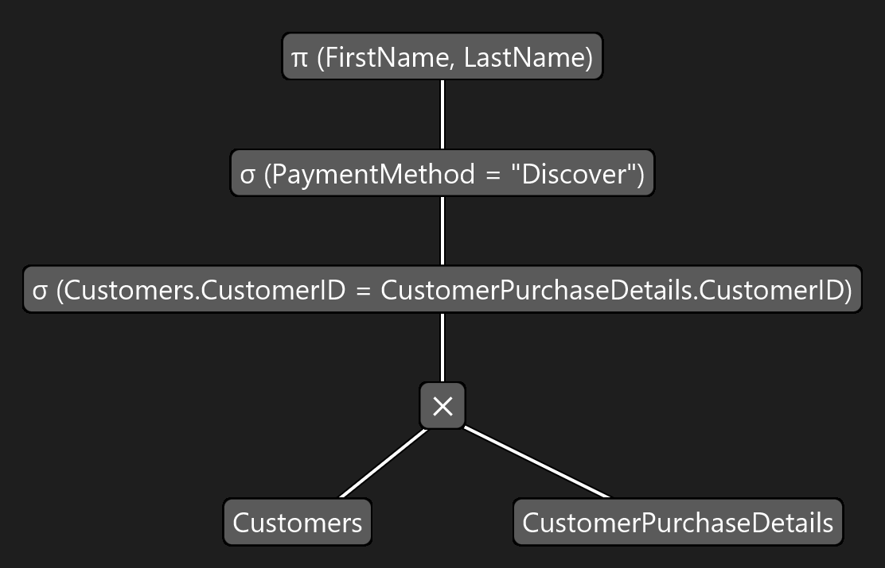
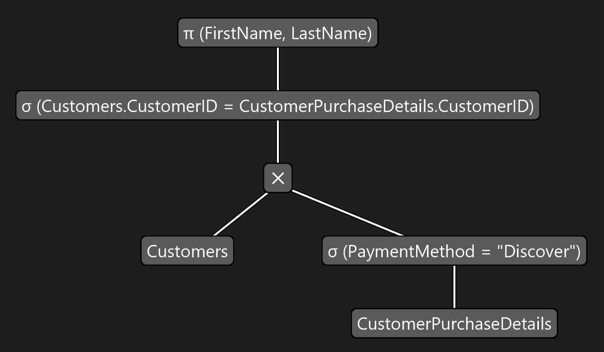
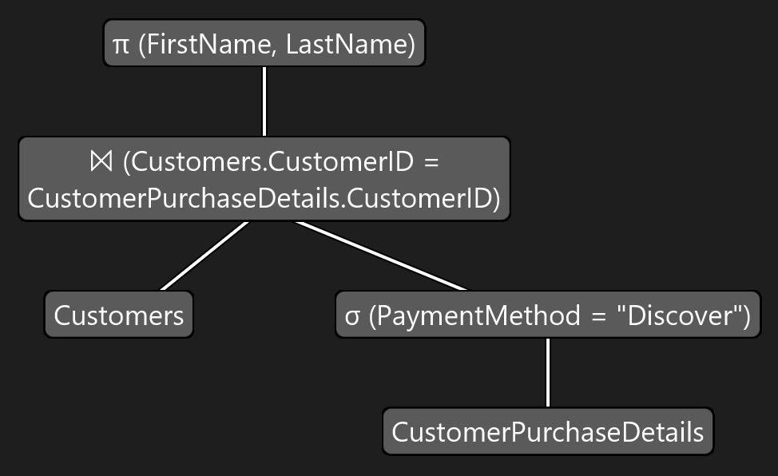
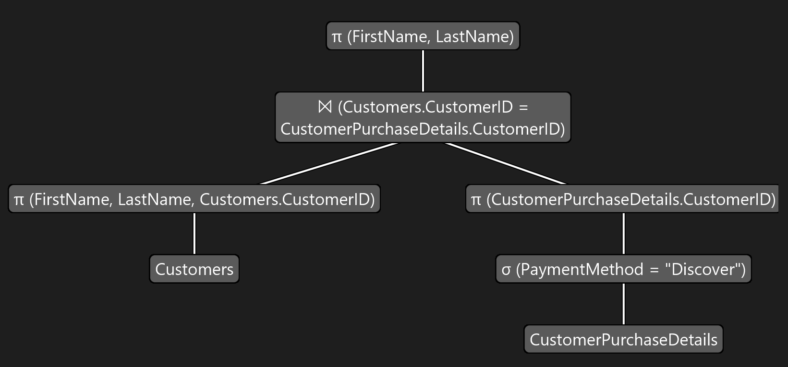

# SQL Emulator and Query Cost Analyzer
## Intro
Hello! This was my Masters Project for Western Illinois University. The goal of this project is to help
students better understand topics that I had a hard time with in my database classes. These topics include:
* Converting Queries to Relational Algebra
* Creation and Optimization of Query Trees
* Query Cost Analysis
* File Structure Recommendations for Improving Query Costs

Additionally, this application also acts as a pseudo SQL emulator. Although writing queries is the main
focus of this application, you have the capability to create tables, query them, modify them, etc. You can
also play as different users, each with their own set of privileges that govern what kinds of commands
they are allowed to execute. 
## Query Syntax
Below is a diagram showcasing the accepted syntax of a Query.

// TODO
## Other Commands
Here are the other commands available. Diagrams for these commands can be found in src/files/images/helpscreen/
* CREATE TABLE
* ALTER TABLE
* DROP TABLE
* INSERT
* UPDATE
* DELETE
* GRANT
* REVOKE
## Query Tree Example
Here is an example of a query being transformed into a query tree. The query tree goes through an optimization process
before being executed.

SELECT FirstName, LastName

FROM Customers, CustomerPurchaseDetails

WHERE Customers.CustomerID = CustomerPurchaseDetails.CustomerID

    AND PaymentMethod = "Discover";
    
### Initial Query Tree

### After Breaking Up Selections

### After Pushing Down Selections

### After Forming Joins

### After Cascading and Pushing Down Projections

### Pipelining Subtrees

