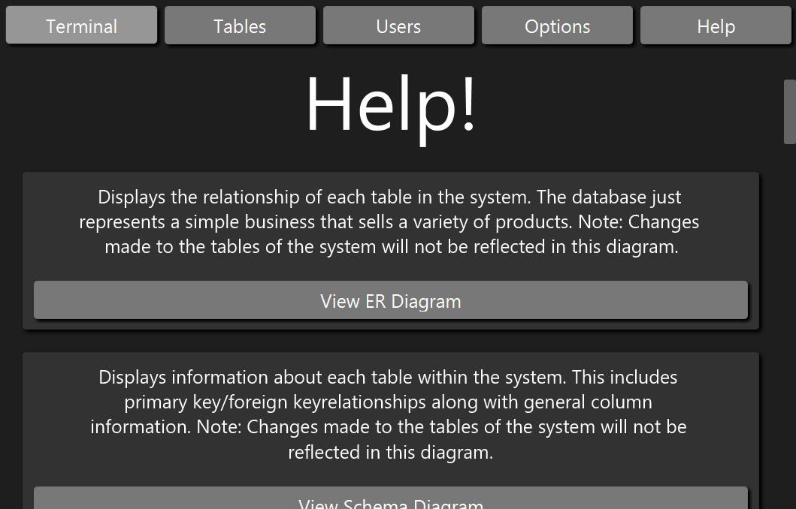
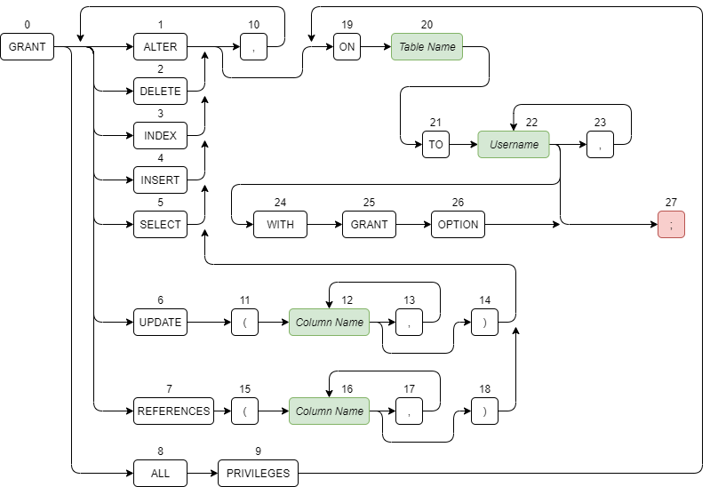
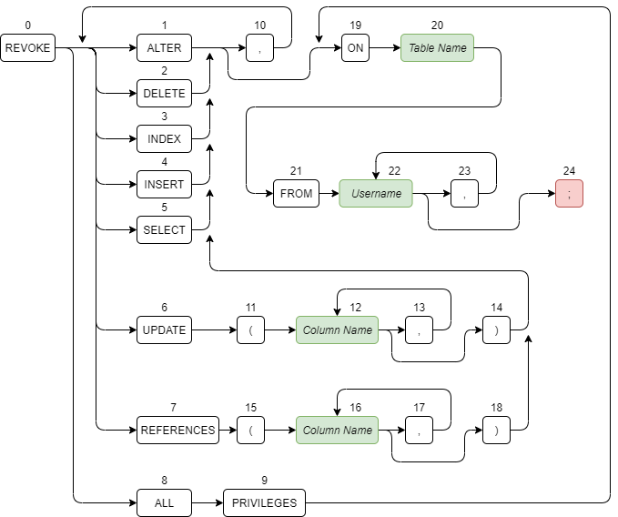

# SQL Emulator and Query Cost Analyzer
## Table of Contents
1. [Introduction](#Introduction)
2. [GUI at a Glance](#GUI-at-a-Glance)
    1. [Terminal Screen](#Terminal-Screen)
    2. [Tables Screen](#Tables-Screen)
    3. [Users Screen](#Users-Screen)
    4. [Options Screen](#Options-Screen)
    5. [Help Screen](#Help-Screen) 
3. [ER Diagram](#ER-Diagram)
4. [Query Syntax](#Query-Syntax)
    1. [Query Examples](#Query-Examples)
5. [Relational Algebra](#Relational-Algebra)
6. [Query Tree Example](#Query-Tree-Example)
    1. [Initial Query Tree](#Initial-Query-Tree)
    2. [After Breaking Up Selections](#After-Breaking-Up-Selections)
    3. [After Pushing Down Selections](#After-Pushing-down-Selections)
    4. [After Forming Joins](#After-Forming-Joins)
    5. [After Cascading and Pushing Down Projections](#After-Cascading-and-Pushing-Down-Projections)
    6. [Pipelining Subtrees](#Pipelining-Subtrees)
7. [Query Cost Analysis](#Query-Cost-Analysis)
8. [Recommended File Structures](#Recommended-File-Structures)    
9. [Other Commands](#Other-Commands)
    1. [CREATE TABLE](#CREATE-TABLE)
    2. [ALTER TABLE](#ALTER-TABLE)
    3. [DROP TABLE](#DROP-TABLE)
    4. [INSERT](#INSERT)
    5. [UPDATE](#UPDATE)
    6. [DELETE](#DELETE)
    7. [GRANT](#GRANT)
    8. [REVOKE](#REVOKE)
## Introduction
Hello! This was my Master's Project for Western Illinois University (Fall 2020). The goal of this project is to help
students better understand topics that I had a hard time with in my database classes. These topics include:
* Converting Queries to Relational Algebra
* Creation and Optimization of Query Trees
* Query Cost Analysis
* File Structure Recommendations for Improving Query Costs

Additionally, this application also acts as a pseudo SQL emulator. Although writing queries is the main focus, you have
the capability to create tables, modify their contents, delete them, etc. You can also play as different users, each
with their own set of privileges that govern what kinds of commands they are allowed to execute. This application was
coded in Java 8, tested using JUnit 5, and uses JavaFX for GUI functionality. Thanks for reading!
## GUI at a Glance
### Terminal Screen
This is where most of the action will take place. Here is a brief description of what each button does.
* Green Play Button - Executes the command entered in the input area. If you don't adhere to the syntax of a particular
command, my application will either yell at you, blow up, or both.
* Eraser Button - Clears the input/output areas.
* Table Button - Launches a new window displaying the result set (the rows returned) of a query.
* Pi Button - Launches a new window displaying a query's equivalent relational algebra.
* Tree Button - Launches a new window displaying a query tree representing the query. You can click around through the
various states the tree takes on during the optimization process in this window.
* Dollar Sign Button - Launches a new window displaying a breakdown of the cost of executing a query.
* Folder Button - Launches a new window suggesting what file structures to build in order to improve query costs.

### Tables Screen
This is where one can browse through the various tables of the system. You can also build file structures on columns
of tables in order to improve query costs.

### Users Screen
This is where one can view and play as the various users of the system. The user that you choose determines what
you are allowed to do in the system.

### Options Screen
This is where one can change how to application behaves. There is also an option to save changes made or restore back to
the initial database.

### Help Screen
This is where one can view the ER diagram representing the database or syntax diagrams of all the commands available.

## ER Diagram
Here is the ER Diagram representing the tables that you can query or manipulate in the application.

## Query Syntax
Since queries are the main focus of this application, here is a diagram outlining a query's accepted syntax. Here are
some things to note:
* The case of strings does not matter. The following is valid, but painful to read.

        SeLEcT fIrStNaME
        FRoM CUsTOmerS;
    
* There must be at least one form of whitespace between strings. The following two examples are valid.

        SELECT FirstName FROM Customers;
        
            SELECT     FirstName
        FROM
          
          Customers;
* A command must end with a semicolon.
* Green nodes are user supplied values.

### Query Examples
Here are some examples of queries that one can write and their result sets.

    SELECT CustomerID, FirstName, LastName
    FROM Customers
    WHERE CustomerID > 20 AND CustomerID < 40;

    
    SELECT Customers.CustomerID, FirstName, LastName, PaymentMethod
    FROM Customers, CustomerPurchaseDetails
    WHERE Customers.CustomerID = CustomerPurchaseDetails.CustomerID
        AND PaymentMethod = "Discover"; 

    SELECT PaymentMethod, COUNT(PaymentMethod)
    FROM CustomerPurchaseDetails
    GROUP BY PaymentMethod
    HAVING COUNT(PaymentMethod) > 10;

## Relational Algebra
Relational algebra is a framework used for modeling queries. Here is an example of a query being transformed into
relational algebra. Both a straight conversion and an optimized one are provided.

    SELECT FirstName, LastName
        FROM Customers, CustomerPurchaseDetails
        WHERE Customers.CustomerID = CustomerPurchaseDetails.CustomerID
            AND PaymentMethod = "Discover";
            

## Query Tree Example
Here is an example of a query being converted into a query tree. Using relational algebra axioms, we can transform the
tree, making processing more efficient. Each section will show the tree after applying a transformation. This is the 
query that we're working with.

    SELECT FirstName, LastName
    FROM Customers, CustomerPurchaseDetails
    WHERE Customers.CustomerID = CustomerPurchaseDetails.CustomerID
        AND PaymentMethod = "Discover";
    
### Initial Query Tree

### After Breaking Up Selections

### After Pushing Down Selections

### After Forming Joins

### After Cascading and Pushing Down Projections

### Pipelining Subtrees
#### First Iteration

#### Second Iteration

#### Third Iteration

## Query Cost Analysis
Analyzing the cost of a query can give us a good understanding of how we can either rewrite it or build file structures
in order to make our queries run faster. This is not the juiciest topic in the world, but information with respect to 
the variables and formulas used can be found in *src/utilities/QueryCost.java*. Here is an example of a 
"Cost Spreadsheet" being produced from the following query.

    SELECT *
    FROM Customers
    WHERE CustomerID = 1;

## Recommended File Structures
Depending on the type of query, we can use file structures to improve the cost of our queries. B-Trees, B+-Trees, and
Hash Tables are built on columns of tables while Clustered Files are built on the tables themselves. Here is a list of
these file structures and when they should be used:
* **B-Tree:** A jack of all trades, should be used when multiple conflicting file structures are recommended at once.
* **B+-Tree:** Best for range queries (a query in which >, <, >=, or <= are used within a condition).
* **Hash Table:** Best for simple queries (a query in which = or != are used within a condition).
* **Clustered Files:** Combines two tables with some form of commonality into a single file. Best used for joins,
however, storing both tables is an expensive overhead.

Here is an example of file structures being recommended on the following query.
    
    SELECT *
    FROM Employees
    WHERE State = "OH" AND Salary > 60000;

## Other Commands
Although writing queries is the main focus of the application, there are other commands available that allow you to
make changes to the system data.
### CREATE TABLE

### ALTER TABLE

### DROP TABLE

### INSERT

### UPDATE

### DELETE

### GRANT

### REVOKE
